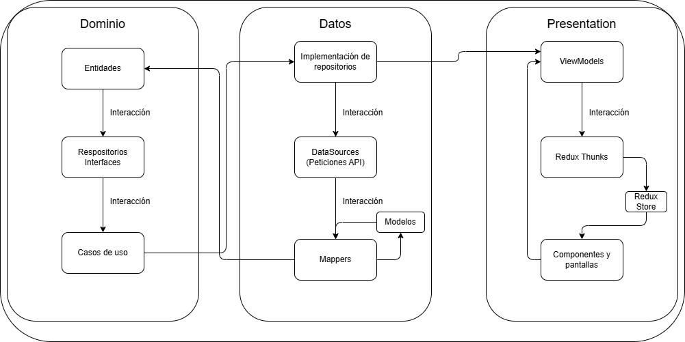
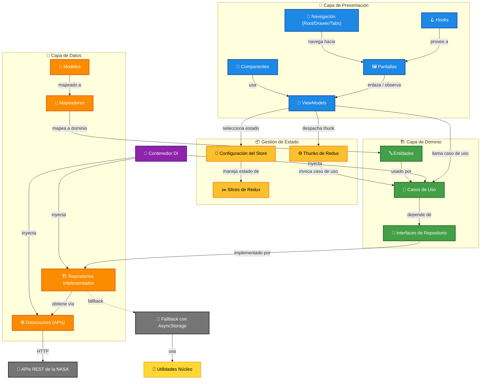
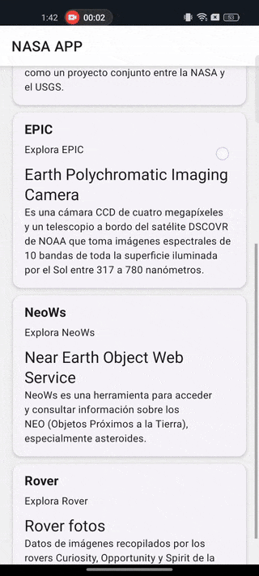

# Lo que se deberá de cumplir

# Aplicación NASA Explorer

Desarrollar una aplicación móvil (Android) y web con **React Native + Expo** que consuma y visualice datos de todas las APIs públicas de la NASA ([https://api.nasa.gov/](https://api.nasa.gov/)), aplicando los principios de arquitectura **CLEAN**, **MVVM**, **principios SOLID**, patrones como **Observer**, **Strategy**, **Factory**, y buenas prácticas **YAGNI**, **KISS** y **DRY**.

---

## 📝 RÚBRICA

| Criterio                                | Descripción                                                                                              | Puntaje |
|-----------------------------------------|----------------------------------------------------------------------------------------------------------|---------|
| **1. Arquitectura CLEAN + MVVM**        | Separación correcta en capas: Data, Domain, Presentation, UI. Uso correcto de ViewModel, Entity, UseCases, Repositories. | 15 pts  |
| **2. Principios SOLID**                 | Aplicación de los 5 principios en lógica de negocio, ViewModels, y servicios. Justificación del diseño usado. | 10 pts  |
| **3. Buenas prácticas: DRY, KISS, YAGNI** | Código limpio, sin duplicidad innecesaria, funciones simples y reutilizables, evita sobreingeniería.    | 10 pts  |
| **4. Consumo de APIs de la NASA**       | Uso real de al menos 5 APIs distintas de la URL, mostrando datos relevantes de forma visual.             | 15 pts  |
| **5. Modo Offline con AsyncStorage**    | Implementación funcional del modo offline con AsyncStorage (fallback para Web). Recuperación de datos en ausencia de red. | 10 pts  |
| **6. Navegación avanzada con React Navigation** | Uso de: Rutas modales, Stack, Drawer, BottomTabs, custom headers.                                       | 10 pts  |
| **7. Animaciones avanzadas con Reanimated** | Uso de animaciones como transición de pantallas, scroll interactivo, botones animados, loaders personalizados. | 10 pts  |
| **8. Formularios Avanzados**            | Uso de react-hook-form o formik con validación, campos personalizados, inputs dinámicos.                | 5 pts   |
| **9. Estado Global con Redux**          | Uso de Redux Toolkit, slices por feature, middleware si es necesario. Integración con lógica offline.   | 5 pts   |
| **10. Paginación con APIs**             | Si alguna API lo permite, implementación de paginación progresiva con scroll infinito o botones.        | 5 pts   |
| **11. Aplicación de Patrones de Diseño**| Implementación de al menos 3 patrones: Strategy, Observer, Factory, Adapter, etc.                       | 5 pts   |

---

## ⭐ BONUS (Máx. 5 pts extras)

- 📸 **Vista de galería interactiva** para la API *Mars Rover Photos* o *NASA Image and Video Library*.
- 🎨 **Cambio de tema dinámico** (día/noche) dependiendo de la API *EPIC* (imágenes solares).

---

## 🧑‍💻 Requerimientos Técnicos

- **Tecnologías**: React Native + Expo + TypeScript  
- **Estado global**: Redux Toolkit  
- **Persistencia local**: AsyncStorage (con fallback Web)  
- **Animaciones**: Reanimated 3  
- **Navegación**: React Navigation (Stack + Tabs + Drawer)  
- **Consumo de API**: Axios  
- **Formularios**: react-hook-form o Formik  
- **Arquitectura**: CLEAN + MVVM  
- **Principios**: SOLID, DRY, KISS, YAGNI  
- **Patrones**: Strategy, Observer, Factory (mínimo 3)  


# Explicación del proyecto 
Para poder usarlo es necesario tener lo siguiente:
- Node.js
- Android Studio (con un emulador inicializado)
- **Opcional:** Móvil con la aplicación instalada de Expo Go
Se es necesario primeramente descargar el proyecto descomprimirlo y seguidamente dentro de la carpeta del proyecto ejecutar el siguiente comando 
```Bash
npm i 
```
Este comando instalará las dependencias utilizadas en el proyecto.
Necesitará realizar un archivo **.env**, con el siguiente contenido

```typescript
API_KEY_NASA = 'DEMO_KEY'
BASE_API_URL_NASA = 'https://api.nasa.gov'
TIMEOUT_API = '8000'

APOD_STORAGE_KEY = 'apod_data'
EARTH_STORAGE_KEY = 'earth_data'
EPIC_STORAGE_KEY = 'epic_data'
NEOWS_STORAGE_KEY = 'neows_data'
ROVER_STORAGE_KEY = 'rover_data'
NAVIGATION_PERSISTENCE_KEY = 'navigation_state_v0.1'
THEME_PERSISTENCE_KEY = 'theme_state_v0.1'
```
**IMPORTANTE:** La API_KEY para esta demostración de ejemplo es la demo, pero puedes generar la tuya en pa página donde se exponen las APIs y los ejemplos de la petición, siendo **https://api.nasa.gov/**

Ahora configurado ello, necesitaremos ejecutarlo, esto con el siguiente comando:
```Bash
npm start
```

Con todo esto el proyecto debe ponerse en marcha!

## Aspectos técnicos
Se trato de seguir la rubrica proporcionada por el profesor, no obstante aqui explicare mediante diagramas la interacción que le di a la aplicación.

- El funcionamiento e interacción:
  

En este primer diagrama se expone como esta constituida el alma de la aplicación considerando la implementación de CLEAN y MVVM, en donde gracias al dominio podemos realizar las acciones necesarias para poder interactuar y que se ven extendidas por la capa de datos.

### Un diagrama hecho por GitDiagram
Este diagrama fue hecho por **GitDiagram**, en donde se adapto con ayuda de la página del playground de **Mermaid**, resultado en el siguiente diagrama:


Ahora bien, en un contexto a modo de texto se tiene:
- Core: Comprende todas las interfaces e utilidades compartidas en toda la aplicación.

- Dominio: Comprende nuestra lógica del negocio donde se expresan nuestras entidades y las acciónes que se llevarán a cabo por medio de "Entidades, Repositorios y casos de uso".

- Datos: Comprende de donde obtendremos los datos, siendo "Fuente de datos, Mapa de datos, Modelo de datos  y Implementación de repositorios".

- Presentación: Este comprende la interfaz que se le presenta al usuario, decidimos utilizar una libreria de componentes para este, aunado al uso de hooks personalizados, viewmodels para interactuar con redux.

- Di: Inyección de dependencias funcionando como contenedor y teniendo un factory para poder mantener limpio el código de esta parte dada la repetición del codigo de parte de los casos de uso con respecto a la implemenctaciones y demas utilerias como lo es Formateo de fechas.

- Navegación: En este comprende el uso de la libreria de React Navigation, teniendo stacks dependientes del uso de cierto tipo de navegación.

- Servicios: En este solo comprende el uso de AsyncStorage y LocalStorage (solo para web), en donde se expone las funciones para guardar, eliminar y borrar toda la memoria.

- Store: En este se encuentra el contexto de la aplicación donde se hace uso de Redux Toolkit para poder generar las funcionalidades como: obtención de datos y cambio de temas.

### La arquitectura y patrones de diseño
Se realizó lo que se pidió en la rúbrica "Arquitectura Clean" con "MVVM", en donde en cuanto a patrones de diseño se tiene:
- Respository: Dato la implementación dada entre casos de uso y funciones elementales existentes en `domain` y `data`.
- Fallback: Dado la implementación de poder guardar y disernir entre si es `web` o `nativo`, aunado si este tiene conexión u no.
- Factory: Dada la necesidad de la inyección de dependencias para que este no se encuentre con demasiado codigo de implementación de repositorio y casos de uso, este se encuentra en `di/factories` y se encuentra usado en `di/container.ts`.

### ¿Cómo se ve la aplicación?
**Pantalla de inicio**


**Una pequña demostración**



**IMPORTANTE esto esta sujeto a cambios**


**Expecial agradecimientos a:** `http://ezgif.com/` y `http://iloveimg.com/es` por la conversión y compresión del recurso anterior.